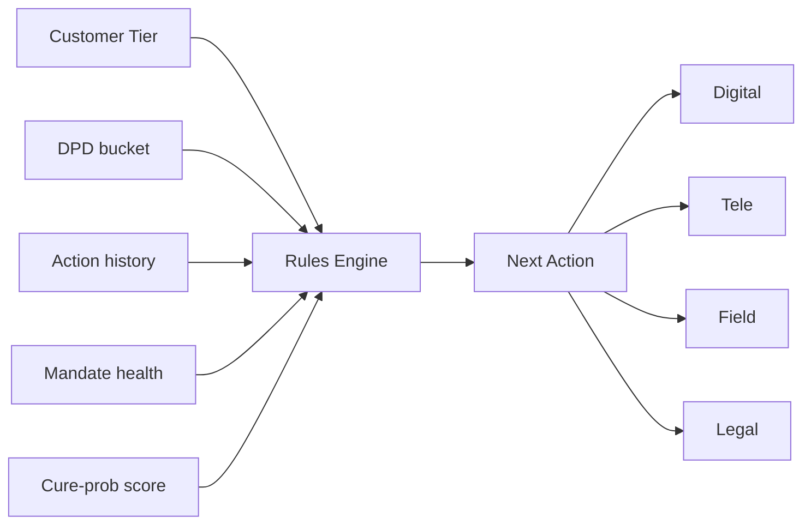
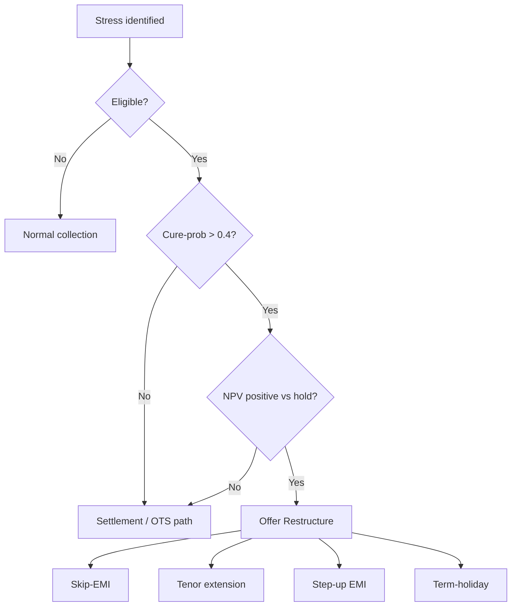
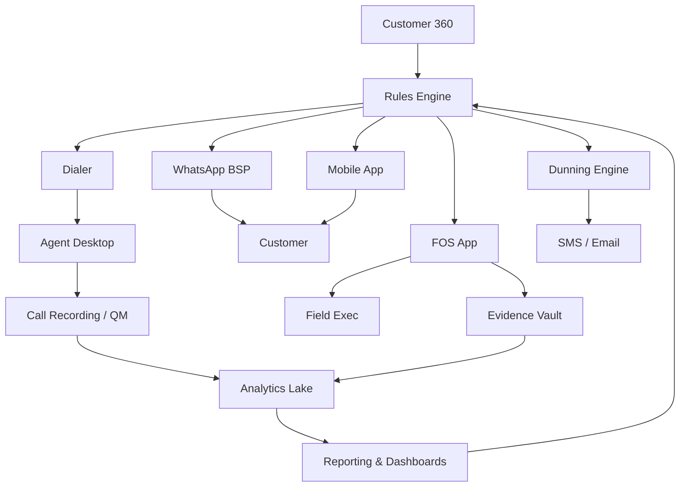

# NBFC 0-90 DPD Collections Operating Playbook

**Version 1.0  ·  FY26  ·  Confidential — Board Material**
**Audience:** Chief Risk Officer, Head of Collections, Head of Analytics, Head of Field Operations, Head of Legal, Head of Customer Experience, Board Risk & Audit Committee.
**Companion to:** *Win the 0-90 Window — Board Strategy Deck.*

---

## Executive Summary

The single largest, most controllable lever for an Indian retail NBFC's return on assets is the **0–90 Days-Past-Due (DPD) window**. Once an account crosses 90 DPD, it becomes a Non-Performing Asset (NPA) under RBI's IRACP norms, attracts Stage-3 ECL provisioning under IndAS 109, drags net interest margin, and triggers an order-of-magnitude rise in cost-to-collect. The early bucket is where economics are made or unmade.

This playbook does three things:

1. **Anchors** the strategy in the RBI Master Direction on Income Recognition, Asset Classification and Provisioning (Nov-12-2021), the Fair Practices Code 2022, the Digital Lending Guidelines, and the SARFAESI Act applicability matrix.
2. **Benchmarks** five archetypal Indian operators — Bajaj Finance, Shriram Finance, HDFC Bank, ICICI Bank, and State Bank of India — across seven collection capabilities, distilling each one's dominant lever and the specific elements we should adopt, adapt, or ignore.
3. **Codifies** the day-by-day operating procedures, call scripts, channel cadences, escalation matrices, KPIs, and RACI tables for **Pre-DPD, 1–30, 31–60, and 61–90 DPD buckets**, segmented into Low / Medium / High risk tiers.

The thesis is simple: **treat 0–90 collections as a manufacturing line — instrumented, segmented, and orchestrated**. Every day saved in the bucket is a basis point on RoA.

The board ask: approve a 90-day execution plan with INR 42 crore tech capex, a +180-FTE in-house tele build-out, a codified restructure-and-OTS framework, a tiered-and-rotated agency governance model, and a CRO-led daily flow huddle as a standing forum.

---

## Table of Contents

1. [How to Use This Playbook](#how-to-use-this-playbook)
2. [Part I — Context & Regulatory Foundation](#part-i--context--regulatory-foundation)
3. [Part II — Competitor Deep-Dive](#part-ii--competitor-deep-dive)
4. [Part III — Our Strategic Architecture](#part-iii--our-strategic-architecture)
5. [Part IV — Operating SOPs by DPD Bucket](#part-iv--operating-sops-by-dpd-bucket)
6. [Part V — Capability Stack](#part-v--capability-stack)
7. [Part VI — Governance & KPIs](#part-vi--governance--kpis)
8. [Part VII — 90-Day Execution Roadmap](#part-vii--90-day-execution-roadmap)
9. [Appendices](#appendices)

---

## How to Use This Playbook

This document is structured for three reading modes:

- **Board / CXO**: Read the Executive Summary, Part I ("Cost of Inaction" subsection), Part II Synthesis, Part VI Board Dashboard, and Part VII Roadmap. Approximate read time: 25 minutes.
- **Operating leaders (Heads of Collections / Risk / Analytics / Field / Legal)**: Read Parts III–VI in full plus the relevant SOP in Part IV. Approximate read time: 90 minutes.
- **Front-line managers and agency partners**: Use Part IV (SOPs), Appendix C (call scripts), Appendix D (templates), and Appendix F (RACI). This is the daily reference.

Every SOP entry follows a consistent structure: **Trigger → Channel actions → Owner → SLA → KPI → Escalation**. If a procedure does not have all five, it is not yet operational.

---

# Part I — Context & Regulatory Foundation

## 1. The Case for Early-Bucket Excellence

Indian retail credit has compounded at ~16% CAGR over FY19–FY25, and unsecured retail at ~22%. With this growth has come delinquency normalisation: sector GNPA peaked at ~6.5% in FY24 and is moderating toward ~4.5% by FY26 per the RBI Financial Stability Report. Inside that aggregate, however, the dispersion among NBFCs is enormous. Top-quartile operators run 1.0–2.5% Stage-3 books; bottom-quartile run 6–9%.

The dispersion is **not** explained by underwriting alone. Underwriting decides who enters the book; collections decide who stays standard. Three structural shifts have made the early bucket the critical battleground:

**Shift 1 — Daily DPD stamping.** The RBI's November 12, 2021 master clarification ended the long-standing NBFC practice of month-end reckoning. Every account is now stamped overdue at *day-end*; an EMI unpaid on the due date counts as overdue from day 1, and an account becomes NPA on the 91st day, irrespective of part-payments. Equally consequential, an NPA can be upgraded only on full clearance of all arrears — a single EMI cure no longer lifts the classification.

**Shift 2 — Customer is digital, intent is brittle.** eNACH and UPI Autopay mandates account for ~70% of new disbursals in retail. Bounce signals are real-time. The reliable signature of a mandate's failure — "insufficient balance" returns three to seven days before the due date — is a leading indicator that most NBFCs do not act on systematically. Customers who could pay often default through inaction, not insolvency.

**Shift 3 — Cost-to-collect is a CFO-level metric.** Field cost per case is rising 12–15% per year (fuel, agent attrition, regulatory compliance overhead). The economics of delinquency now demand channel orchestration — digital first, tele second, field selectively, legal disciplined — rather than the historical default of "send a runner."

Against this backdrop, the early bucket compresses three independent value pools:

- **Provisioning savings**: a Stage-1 → Stage-2 migration multiplies ECL provision 3-5×. Preventing migration is a direct hit to provisions, not a soft saving.
- **Recovery economics**: cure probability on a 1–7 DPD account is ~70%; on a 60+ DPD account, under 30%. Time, not technique, is the dominant variable.
- **Customer lifetime value**: the customer who self-cures with a respectful nudge returns for cross-sell. The customer who is field-pursued at 45 DPD does not.

A simple model on a Rs 100 crore monthly delinquent flow shows the cascade clearly: an additional 8 percentage points of cure rate in 1–30 DPD is worth approximately Rs 18–24 crore of avoided P&L drag annually for a mid-sized NBFC, before counting the option value of preserved cross-sell.

## 2. RBI Regulatory Anchor

Indian NBFC collections operate inside a tightening regulatory perimeter. The five instruments that matter most:

### 2.1 RBI Master Direction on IRACP — Nov-12-2021 (and subsequent clarifications)

This circular harmonised NBFC asset classification with banks. Operative provisions:

- **Daily classification.** The classification of advances must be done daily, not month-end. An account is "overdue" the day after the due date if not paid in full.
- **Special Mention Account (SMA) framework.** SMA-0: 1–30 DPD. SMA-1: 31–60 DPD. SMA-2: 61–90 DPD. NPA: 91+ DPD. For exposures of Rs 5 crore and above, SMA classification is reportable to the Central Repository of Information on Large Credits (CRILC).
- **NPA upgrade rule.** An account classified as NPA can be upgraded to standard only on clearance of the **entire arrears** of principal and interest. A partial payment that brings DPD below 90 does not upgrade the account.
- **Income recognition.** Interest income on NPA accounts may be recognised only on realisation, not accrual.
- **Provisioning.** Standard, Sub-standard, Doubtful, and Loss categories carry mandated minimum provisioning under IRACP, separate from (and lower than) IndAS ECL where IndAS applies.

The implication for the operating model is non-negotiable: a real-time DPD engine is a regulatory minimum, and *cure must be defined as full-arrears resolution*, not nominal recovery.

### 2.2 IndAS 109 — Expected Credit Loss

IndAS-mandated NBFCs (most large operators) provision under a forward-looking ECL model:

- **Stage 1**: 12-month ECL on performing accounts.
- **Stage 2**: lifetime ECL on accounts that have shown a Significant Increase in Credit Risk (SICR). The 30+ DPD trigger is a presumptive SICR; behavioural triggers (e.g., bureau score deterioration, sectoral stress) can also push an account into Stage 2 below 30 DPD.
- **Stage 3**: lifetime ECL on credit-impaired accounts (default, typically aligned with NPA).

The Stage-1-to-Stage-2 multiplier is portfolio-specific but typically 3-5×; Stage-2-to-Stage-3 is a further 1.5-2.5×. The ECL gradient is the financial reason early-bucket excellence dominates the P&L.

### 2.3 Fair Practices Code for Recovery Agents (RBI 2022 directions)

Binding constraints on collections behaviour:

- **No contact between 7 PM and 7 AM.** Outreach windows must be enforced in the dialer and FOS app.
- **No harassment.** No threats, no contacting the customer's neighbours/employer except to ascertain whereabouts under defined conditions.
- **Recorded calls.** Outbound calls from regulated lenders must be recorded; agency calls must be recorded under contractual obligation.
- **Agent identity.** Recovery agents must carry verifiable identification and authorization letters; the lender remains responsible for agent conduct.
- **Grievance redressal.** Lender must provide a designated grievance officer and a 30-day resolution clock; customer may escalate to the RBI Ombudsman.

Non-compliance has produced material RBI penalties and customer-facing reputational damage. The playbook's call-script and FOS-visit SOPs encode these constraints by design.

### 2.4 Digital Lending Guidelines (RBI September 2022, plus FLDG directions June 2023)

Relevant to collections:

- **Lender of record (LSP/RE distinction).** Only the regulated entity (RE) holds the loan; Lending Service Providers (LSPs) cannot collect on their own books.
- **Cooling-off period.** Customer can exit a loan within a defined window with limited charges.
- **Key Fact Statement (KFS).** All charges, including bounce/late fees, must be disclosed up-front. Hidden bounce charges later weaponised in collections are non-compliant.
- **First Loss Default Guarantee (FLDG)** is permitted up to 5% of the loan portfolio, with structural conditions; this changes the economic share of risk in partner-originated portfolios but does not transfer the operating responsibility.

### 2.5 SARFAESI Act Applicability

NBFCs with asset size of Rs 100 crore and above are notified to use SARFAESI for secured exposures of Rs 20 lakh and above. Operative levers:

- **Section 13(2) demand notice**: 60-day demand. The SOP threshold for issuing 13(2) is the lever; we recommend a tight, segment-specific trigger (typically 75 DPD for high-risk secured).
- **Section 13(4)**: possession of secured asset post-13(2) without court intervention, subject to safeguards.
- **DRT / SARFAESI tribunal**: borrower remedy under Section 17.

For unsecured exposures, the Negotiable Instruments Act Section 138 (cheque bounce) and arbitration clauses in loan agreements (where present) substitute for SARFAESI.

## 3. The P&L of the 0–90 Window

A reduced-form model on a representative mid-sized NBFC retail book illustrates the asymmetry:

| Metric | Pre-DPD | 1–30 DPD | 31–60 DPD | 61–90 DPD | 90+ DPD |
| --- | --- | --- | --- | --- | --- |
| Cure probability (treated, blended) | n/a (avoid bounce) | 62-68% | 38-46% | 24-32% | 10-14% |
| Marginal cost-to-collect (% of POS) | 0.05-0.10% | 0.4-0.8% | 1.5-2.4% | 4.0-6.0% | 8-12% |
| Provisioning multiplier vs Stage-1 | 1.0x | 1.0-3.0x (S1→S2 if SICR) | 3.0-5.0x | 4.0-6.0x | 8-15x (Stage-3) |
| NPS impact (relative to clean book) | 0 | -8 to -12 | -18 to -28 | -32 to -46 | -50+ |

Read horizontally: the cure curve falls and the cost curve rises non-linearly. Read vertically: the dominant value pool is in the *first three columns*, which together account for roughly 80% of preventable P&L drag.

## 4. Cost of Inaction — The Roll-Forward Cascade

If the same 100 customers enter Pre-DPD each month and the operator does *nothing*:

- ~95 will enter 1–30 DPD (mandate-bounce conversion ~5%).
- Of those, ~55 will roll to 31–60 DPD (untreated).
- ~38 will roll to 61–90 DPD.
- ~26 will roll to NPA.

If the same 100 customers are treated with the playbook below:

- ~88 enter 1–30 DPD (pre-due nudges and mandate-health pull bounce conversion to ~3%).
- ~32 roll to 31–60 (treated cure ~64%).
- ~13 roll to 61–90 (treated cure ~58%).
- ~6 roll to NPA.

The difference — 26 NPAs vs 6 — is the strategy. Everything that follows is the *how*.

---

# Part II — Competitor Deep-Dive

The five operators below were chosen because they represent the dominant archetypes of Indian credit collections. Bajaj Finance is the digital-self-cure champion in unsecured retail. Shriram Finance is the relationship-and-collateral champion in cyclical secured. HDFC, ICICI, and SBI represent three distinct bank operating models — challenger discipline, self-serve design, and scale-and-legal funnel — at multiples of NBFC scale. The figures cited are public-domain or industry-consensus estimates for FY24/FY25; they are illustrative and labelled as such.

## 5. Bajaj Finance — The Digital Cure Machine

### 5.1 Business Model and Book Composition

Bajaj Finance Limited (BFL) operates a multi-product retail and SME lending franchise: consumer durables, two-wheeler, personal loans, salaried personal loans, business loans, mortgages, gold, rural lending, and emerging digital products. AUM is approximately Rs 4.0 lakh crore (FY25E), customer franchise crossed 9 crore in FY25. The book is unsecured-heavy by share of unique customers but secured-heavy by AUM.

Indicative quality metrics: gross Stage-3 around 1.0%, net Stage-3 around 0.45%; cost-to-income in the high-30s, RoA at 4.5–5.0%. These metrics are best-in-class for an unsecured-heavy retail book and are not explained by underwriting alone — collections discipline is a substantial part of the moat.

### 5.2 Pre-DPD: Mandate-Health Obsession

BFL treats every active eNACH/UPI Autopay mandate as a living asset. The mandate is scored daily on the probability of the next debit failing, using features such as:

- recent NACH bounce history on this mandate and on the bank account
- average end-of-month balance trajectory in the customer's primary bank (where available via account aggregators)
- recent transaction pattern: salary credit timing, festival-month spend signals
- secondary signals from the BFL app: login frequency, EMI-card usage, complaint history

Action triggers from the score:

- **T-3 days**: app push and WhatsApp reminder; if mandate-health is amber, present a one-tap "switch debit account" CTA.
- **T-1 day**: SMS + WhatsApp; for red-flag mandates, an IVR pre-bounce nudge.
- **T+0**: NACH presentation. If failed, automatic re-presentation on T+2 with prior intimation.
- **T+0 also**: bounce-fee waiver as cure incentive — pay the missed EMI by T+3 and the bounce charge is waived. This is shown to materially lift early cure.

### 5.3 1–30 DPD: App-First Self-Cure

The defining design choice: **the customer reaches the agent only after the app, IVR-bot, and WhatsApp have failed**. The cure path:

1. Day 1: WhatsApp pay-link, app push with one-click pay, email with statement and pay-link. PTP can be captured digitally with auto-debit on PTP date.
2. Day 3 (uncured): IVR-bot call. If no response, agent call.
3. Day 7 (uncured): supervisor escalation; restructure offer surfaced if cure-prob model warrants.
4. Day 14+ (uncured): agency Tier-2/3 begins parallel work.

The bot-first architecture cuts cost-to-cure by an order of magnitude on Tier-L (low-risk) and a meaningful share of Tier-M.

### 5.4 31–90 DPD: Tiered Agency Orchestration

BFL runs four agency tiers:

- **Tier-1**: in-house tele, premium accounts, low DPD.
- **Tier-2**: external premium agencies for high-ticket, mid-DPD.
- **Tier-3**: volume agencies for high-volume, mid-ticket.
- **Tier-4**: specialist legal/repo for late-bucket and recovery.

Cases auto-rotate on no-cure within stage SLAs. Agencies are scored daily on cure rate (full-arrears, not nominal collection); bottom-decile agencies are rotated out quarterly. Incentive is cure-weighted: 60% of agency commission earned only on full cure, 30% on PTP-kept, 10% on confirmed contact.

### 5.5 Restructure and Flexi

BFL's "Flexi" loan product allows part-prepayment and re-drawal within a sanctioned limit; in the collections context, Flexi customers in early stress get an interest-only "term holiday" rather than a hard restructuring. For non-Flexi customers in genuine hardship, a one-time EMI moratorium is offered via the app, with eligibility gated by behavioural and bureau signals.

### 5.6 What We Adopt, Adapt, Ignore

- **Adopt**: the mandate-health engine, the bot-first dunning architecture, the tiered agency model with cure-weighted incentives, the bounce-fee-waiver-as-cure-lever.
- **Adapt**: the Flexi-style restructure for our non-revolving book — codify a "term holiday with NPV-positive test" framework (see Part IV.18 and Appendix H).
- **Ignore**: BFL's deep app-engagement model is hard to replicate without their cross-sell engine; we substitute a leaner WhatsApp-first interface.

## 6. Shriram Finance — The Relationship Engine

### 6.1 Business Model

Shriram Finance Limited (formed by the 2022 merger of Shriram Transport Finance and Shriram City Union Finance) runs a sub-prime, predominantly secured lending franchise: used commercial vehicles, passenger vehicles, MSME, two-wheeler, gold, and personal loans. AUM ~Rs 2.5 lakh crore (FY25E), branch network ~3,000, with a deeply branch-anchored field organisation.

Indicative quality metrics: gross Stage-3 in the 5.0-5.5% range — *higher* than prime NBFCs but stable through cycles, and embedded in pricing. RoA 3.0-3.3%; the book is a structural cycle-tested machine.

### 6.2 Pre-DPD: Cluster Intelligence

Shriram's defining capability is *ground-level borrower knowledge*. Each branch officer manages 200-400 customer relationships in a defined cluster. The officer knows:

- the route the truck operator runs, the freight cycle, and the seasonal pattern
- the diesel-price stress and toll-policy impact on the route
- the customer's family composition, co-borrower, and guarantor
- the secondary income sources (other vehicles, wife's tailoring shop, son's small kirana)

EMI dates are deliberately set to align with cash-flow realisation, not month-start convenience. For example, a Mumbai-Nagpur cement transporter is given an EMI date five days after typical trip-completion settlement.

### 6.3 1–60 DPD: Field-Led Negotiation

Doorstep contact begins at day 5 for high-risk and day 10 for medium-risk. The conversation is *trust-led*, not script-driven. The officer acknowledges the stress event (a breakdown, a freight slowdown), discusses verifiable income disruption, and offers a reschedule against documented evidence.

The cure-on-PTP rate at Shriram is reported above 70%, materially higher than the industry's <50%. The reason is that PTPs are negotiated, not extracted — an offered date that fits cash-flow is a date that holds.

### 6.4 61–90 DPD: Repo SOP and Used-CV Remarketing

For secured exposures, Shriram's vehicle repossession is industrial-grade. The chain of custody:

- 13(2) notice issued on a calibrated trigger (typically 60-75 DPD)
- repossession by in-house repo agents trained on safe-handling and Fair Practices
- yard intake at one of ~60 yards across the country
- valuation, refurbishment if needed
- auction within 21 days through a dealer-network platform

Loss-given-default is structurally lower than peers because the remarketing channel is owned, not outsourced.

### 6.5 Cyclical Restructure

Reschedule offers are designed for cyclical income: skip an EMI in a low-revenue month and step it up later; convert a hard EMI to a seasonal EMI; extend tenor with revised LTV. Restructure is not a stigma at Shriram — it is a planned product.

### 6.6 What We Adopt, Adapt, Ignore

- **Adopt**: the cluster-officer relationship model for our secured / MSME book, the seasonal-EMI restructure, the in-house repo SOP and yard discipline.
- **Adapt**: build cluster intelligence as a *digital* layer (geo-stress overlay, sectoral cash-flow calendars) so the officer is augmented, not replaced.
- **Ignore**: the highly localised, cash-led field economics that Shriram inherits from a 40-year branch presence are not replicable in the medium term.

## 7. HDFC Bank — Champion-Challenger Discipline

### 7.1 Operating Posture

HDFC Bank runs a multi-segment retail book — credit cards, personal loans, vehicle loans, mortgages, business banking, and Vyapaar / SmartHub for SMEs. Retail GNPA in the 1.0-1.3% range; the bank's collections operating model is a textbook of *repeatability*.

### 7.2 In-House Core, Tiered Outsourcing

Tier-1 collections — high-ticket, low-DPD, sensitive customer segments — are held in-house. Tier-2 (volume mid-DPD) is outsourced to a small, well-managed bench of agencies; Tier-3 (long-tail late-bucket) is wider. The tier definition is reviewed semi-annually.

### 7.3 Predictive Dialer and Champion-Challenger

The collections dialer is fed a real-time list refresh — a customer who pays at 11:00 AM is removed from the afternoon's list at 11:01 AM. Agent screens are primed with the last 90 days of behaviour: bounce history, prior PTPs and PTP-keep rate, channel preference, complaint history.

The bank runs continuous champion-challenger experiments — on dunning copy, time-of-day, channel sequence, voice tone, agent script — refreshed every two weeks. The challenger that wins becomes the champion; a new challenger is set against it. This is a *system*, not a one-off lift.

### 7.4 The Daily Bucket-Flow Meeting

A 30-45 minute daily review of bucket flow, owned by the head of collections, with all DPD-bucket leads present. The agenda is fixed: yesterday's roll-forward, today's at-risk top-N, channel-mix anomalies, agent-and-agency outliers, customer-experience flags. *"The meeting that runs the bank,"* in the words of a former HDFC CRO.

### 7.5 What We Adopt

- The operating cadence — daily, weekly, monthly — and challenger discipline.
- The in-house core principle: keep Tier-1 in the building; rent the tail.

## 8. ICICI Bank — Self-Serve by Design

### 8.1 The iMobile Restructure Lever

ICICI's iMobile app surfaces a one-tap EMI rescheduler: one free deferral every 12 months, instant approval if the cure-probability score clears a defined threshold, ~60-second turnaround. This converts what would have been a 25-minute call to a self-serve transaction at near-zero cost-to-collect.

### 8.2 WhatsApp Business API and Voice Cadence

A multi-channel cadence orchestrates WhatsApp + email + voice calls based on customer preference and engagement signal. WhatsApp captures pay-links, statements, PTPs, and even disputes; voice escalates only when the digital cadence fails.

### 8.3 Geo-Tagged FOS App

Field officers operate a digital app with mandatory geo-tag on visit, photo evidence of doorstep contact, and recorded conversation. The bank samples 5% of visits for central QC. This drove a measurable lift in field productivity and a sharp reduction in FOS-misconduct complaints.

### 8.4 Co-Applicant Chain

Co-applicant intimation is auto-triggered at 30 DPD, not 60+; the leverage of social pressure is much higher when applied early and respectfully.

### 8.5 What We Adopt

- The self-serve EMI rescheduler with cure-prob gating.
- The geo-tagged FOS app and 5% central QC sampling.
- The co-applicant auto-intimation at 30 DPD.

## 9. State Bank of India — Scale, Settlement Calendar, Legal Funnel

### 9.1 Calendarised OTS Schemes

SBI publishes quarterly One-Time Settlement (OTS) schemes for defined stress segments (e.g., MSME COVID-stress book, agriculture stress in specified districts). The schemes are *governance-led*: pre-approved discount bands, eligibility filters, and authority matrices, not deal-by-deal negotiation.

### 9.2 Lok Adalat as a Volume Channel

SBI's use of Lok Adalat for late-bucket recovery is the most institutionalised in Indian banking. Reportedly 16-20% of late-bucket collections by case-count flow through Lok Adalat sessions. The mechanism is a fast, low-cost civil settlement with judicial sanction.

### 9.3 SARFAESI Funnel Discipline

A defined trigger automatically issues a Section 13(2) notice; the calendar from notice to possession is tracked; possession-to-auction TAT is reported. The funnel runs as a process, not a series of decisions.

### 9.4 What We Adopt

- A calendarised OTS framework for SMA-2 and just-NPA accounts.
- A Lok Adalat referral playbook for the 60-90+ bucket (where applicable to our book size and regions).
- A 13(2) auto-trigger discipline for secured exposures.

## 10. Synthesis — Capability Scoring and Adoption Shortlist

Scoring each operator from 1 (basic) to 5 (best-in-class) on the seven levers that matter:

| Lever | BAF | Shriram | HDFC | ICICI | SBI | Our FY27 target |
| --- | --- | --- | --- | --- | --- | --- |
| Pre-DPD nudge | 5 | 4 | 4 | 4 | 2 | 5 |
| Tele cure | 5 | 3 | 5 | 4 | 3 | 4 |
| Digital self-cure | 5 | 2 | 4 | 5 | 2 | 5 |
| Field / FOS | 3 | 5 | 4 | 4 | 5 | 4 |
| Restructure | 4 | 5 | 3 | 4 | 5 | 5 |
| Legal funnel | 3 | 4 | 4 | 4 | 5 | 4 |
| Analytics & ops | 5 | 3 | 5 | 4 | 3 | 5 |

Adoption shortlist:

1. **Mandate-health engine** (BAF) — Pillar I.
2. **App-first / WhatsApp-first dunning** (BAF, ICICI) — Pillar II.
3. **Tiered agency with cure-weighted incentives** (BAF) — Pillar IV.
4. **Cluster intelligence layer for secured/MSME** (Shriram) — Pillar I + II.
5. **Self-serve EMI rescheduler** (ICICI) — Pillar II.
6. **Geo-tagged FOS app with 5% QC** (ICICI) — Pillar V.
7. **Co-applicant auto-intimation at 30 DPD** (ICICI) — Pillar II.
8. **Champion-challenger weekly cadence** (HDFC) — Pillar VI.
9. **Daily bucket-flow huddle** (HDFC) — Pillar VI.
10. **Calendarised OTS framework** (SBI) — Pillar IV (61–90 SOP).
11. **Lok Adalat referral playbook** (SBI) — Pillar IV (61–90 SOP).
12. **SARFAESI 13(2) auto-trigger** (SBI) — Pillar IV (61–90 SOP).

These twelve adopt-and-adapt items form the back-bone of Parts III–V.

---

# Part III — Our Strategic Architecture

## 11. The Six Pillars

| Pillar | Outcome | Single-Threaded Owner | 90-Day First Deliverable |
| --- | --- | --- | --- |
| I. Data & Decisioning | Daily action queue, ranked | Head of Risk Analytics | Customer 360 + Mandate-health v1 + DPD stamping |
| II. Channel Orchestration | Top-quartile cost-to-collect | Head of Collections | Channel rules engine v1 with bot-first dunning |
| III. Customer Experience | Collections NPS above -10 | Head of CX | Tone & hardship policy + FPC compliance audit |
| IV. Workforce & Agency | Agency cure uplift +15% | Head of Operations | Tier definitions, cure-weighted incentive, rotation |
| V. Tech Stack | Single pane of glass | Chief Technology Officer | Dialer + WhatsApp BSP + FOS app + dunning engine |
| VI. Governance | The meeting that runs collections | Chief Risk Officer | Daily flow huddle + monthly NPA-prevention scorecard |

Each pillar has one accountable owner. Cross-pillar projects exist but never replace single-threaded ownership.

## 12. Risk Segmentation Framework

Customers are scored monthly into Tier-L, Tier-M, Tier-H using a behavioural-and-bureau model. Approximate distribution on a healthy retail book: L ~55%, M ~30%, H ~15%. Tier-H drives ~70% of losses.

### 12.1 Tier Definitions

**Tier-L (Low risk)**: salaried or secured, clean bureau (no DPD in last 12 months, score in top 30% for the segment), mandate health green, app/WhatsApp engaged. *First-slip* posture: a bounce here is most likely a banking glitch or a mandate-account change, not an intent issue.

**Tier-M (Medium risk)**: self-employed, MSME borrower, mild bureau stress (one or two 1-30 DPD events in last 12 months, mid-band score), mandate health amber, seasonal cash-flow patterns. *Cyclical* posture: a bounce here is most likely a real cash-flow gap; treatment must be respectful and offer-positive.

**Tier-H (High risk)**: thin-file or sub-prime, repeated bounce history, geographic or sectoral stress flags, broken PTPs in prior cycles, fraud-suspect signals (PAN/Aadhaar inconsistencies, address mismatches), mandate health red. *Stress-and-intent* posture: a bounce here demands fast, multi-channel, evidence-led intervention.

### 12.2 Scoring Features

The model uses approximately 18-22 features grouped into:

- **Bureau** (4-5 features): score deltas, recent enquiries, other-lender DPD, total leverage.
- **Mandate health** (3-4 features): bounce history on this mandate, bank-account end-of-month balance trend, mandate-account change frequency.
- **Behavioural** (4-5 features): PTP-keep rate, complaint history, app login activity, channel-preference signal.
- **Macro overlay** (3-4 features): pin-code stress index, sectoral stress (transport, textiles, etc.), seasonal calendar.
- **Identity / fraud** (2-3 features): KYC anomaly flags, address verification result, social-graph signals where permitted.

Refresh: monthly cohort recalibration; weekly score updates within stable cohort definitions; daily mandate-health refresh.

### 12.3 Treatment Differentiation

Tier drives *intensity* and *channel mix*, not whether to act. Every customer in a delinquent state gets some action; only Tier-L escapes field cost in early buckets, only Tier-H sees field at day 5, etc.

## 13. Channel Orchestration Rules Engine

The rules engine is a deterministic decision layer that, given (customer, current DPD, tier, recent action history, channel availability, budget), emits the next-best action. It runs every morning at 6 AM and on event triggers (e.g., a new bounce, a PTP broken).

The output for each customer-day is a single ranked recommendation with channel, intensity, copy variant, and cost ceiling. Override authority sits with the bucket manager and is logged. Override rates above 8% trigger a rules-engine review.

## 14. Customer 360 Data Model

A unified view that merges loan-account, behavioural, bureau, mandate, channel-engagement, complaint, and field-history data into one identity. Operative properties:

- One customer ID, even across multiple loans.
- One DPD-bucket label, taken as the worst across loans.
- One tier label, refreshed monthly.
- One *next action* and one *owner* on any given day.
- Full audit trail: who contacted, when, on what channel, what was the outcome.

This is the foundation for everything else. Without it, segment, channel, and governance are all theatre.

---

# Part IV — Operating SOPs by DPD Bucket

This is the heart of the playbook. Each SOP follows the same shape: trigger, day-by-day actions by tier, channel-wise responsibilities, scripts and templates referenced, escalation matrix, KPIs and SLAs, RACI.

## 15. SOP — Pre-DPD (T-7 to T-1)

### 15.1 Purpose

Prevent the bounce. The cheapest cure is the EMI that never bounces.

### 15.2 Trigger

Daily — every account with an EMI due in the next 7 days enters the Pre-DPD list, refreshed by 6 AM.

### 15.3 Channel Actions by Tier

| Channel | Tier-L | Tier-M | Tier-H |
| --- | --- | --- | --- |
| App push | T-3, T-1, T+0 | T-3, T-1, T+0 | T-5, T-3, T-1, T+0 |
| WhatsApp | T-3 | T-3, T-1 | T-5, T-3, T-1 |
| SMS | T-1 | T-1 | T-2, T-1 |
| Email | T-3 (statement) | T-3 (statement) | T-3 (statement) |
| IVR-bot | None | T-2 if mandate amber | T-3 mandatory |
| Agent call | None | On no-response to IVR | T-2, soft tone |
| Field | None | None | Geo-flag pin-code; FOS standby |

### 15.4 Mandate-Health Specific Actions

- Mandate score green: standard cadence.
- Mandate score amber: present "switch debit account" CTA in app and WhatsApp; offer e-mandate registration on alternate account.
- Mandate score red: agent call by T-3; offer pre-payment via UPI link as one-time alternative; if customer agrees, suppress NACH presentation.

### 15.5 Scripts and Templates

- Pre-due IVR-bot: *Appendix C, script PD-01.*
- Pre-due agent call (Tier-H): *Appendix C, script PD-02.*
- WhatsApp template: *Appendix D, template WP-PD-01 / WP-PD-02 (Hinglish).*
- App push: *Appendix D, template AP-PD-01.*

### 15.6 Escalation Matrix

| Trigger | Escalation | SLA |
| --- | --- | --- |
| Mandate health red, customer unresponsive at T-2 | Senior agent call | Same day |
| 3 consecutive bounces in last 6 months | Re-segment to Tier-H | T+0 |
| Customer requests payment-date change | Self-serve in app; if not eligible, agent | 24 hours |

### 15.7 KPIs and SLAs

| KPI | Target | Owner |
| --- | --- | --- |
| Mandate fail-rate (NACH bounce + UPI fail) | < 5.5% | Head of Digital |
| Pre-due connect rate (Tier-M+H) | > 70% | Head of Tele |
| Mandate-account-switch self-serve completion | > 60% of red | Head of Digital |
| Bounce model AUC | > 0.78 | Head of Risk Analytics |

### 15.8 RACI

| Activity | R | A | C | I |
| --- | --- | --- | --- | --- |
| Mandate-health scoring | Risk Analytics | CRO | Tech, Collections | All Heads |
| Pre-due app push | Digital Marketing | Head of Digital | CX, Collections | CRO |
| Pre-due IVR-bot | Tele Ops | Head of Tele | Tech | Collections |
| Pre-due agent call (H) | Senior Tele | Head of Tele | Risk | CRO |
| Geo-flag standby (H) | Field Ops | Head of Field | Risk | Collections |

## 16. SOP — 1-30 DPD (SMA-0)

### 16.1 Purpose

Where ~62% of cure happens — if we move fast. The first seven days drive two-thirds of bucket cure.

### 16.2 Trigger

T+1 (day after EMI due date) — automated migration into the 1-30 list at 06:00.

### 16.3 The 7-Day Window SOP

The first seven days are the emergency room. Day-by-day prescription:

**Day 1 (T+1)**

- App push and WhatsApp pay-link to all delinquent customers.
- Bounce-fee waiver flag set: pay by D+3 and the bounce charge is reversed.
- For Tier-H: simultaneous IVR-bot call and PTP-capture push.

**Day 2**

- WhatsApp follow-up, all tiers.
- Tier-M IVR-bot call.

**Day 3**

- Tier-L: IVR-bot call; if no response, agent call.
- Tier-M: agent call (recorded).
- Tier-H: senior agent call; PTP capture mandatory.

**Day 4-5**

- Tier-L: continued digital cadence; agent on no-response.
- Tier-M: daily agent attempts; PTP capture.
- Tier-H: doorstep PTP visit if no PTP captured digitally.

**Day 6-7**

- All tiers: supervisor escalation if uncured.
- Tier-H: second FOS attempt; co-applicant intimation prepared.

**Day 8-14**

- PTP-keep monitoring: any broken PTP triggers immediate supervisor escalation and re-tier consideration.
- Restructure offer surfaced for cure-prob-positive cases.

**Day 15-30**

- Agency Tier-2/3 begins parallel work for uncured Tier-M and Tier-H.
- Co-applicant intimation at Day 25-30 for accounts heading into 31+ DPD.

### 16.4 Channel Actions by Tier (Summary)

| Channel | Tier-L | Tier-M | Tier-H |
| --- | --- | --- | --- |
| Digital / Self-serve | Daily until cure or D+10 | Daily, plus rescheduler offer | Daily, plus PTP-capture priority |
| Tele / IVR | D+3 onwards on no-response | Daily from D+1; supervisor at D+7 | Twice-daily D+1-7; recorded |
| Field / FOS | None | None until D+25 | Doorstep PTP visit D+5-10 |
| Legal | NA | NA | Notice template prepped at D+25 |

### 16.5 Self-Serve Rescheduler

The rescheduler is the single highest-leverage product feature on this bucket. Logic:

- Eligibility: cure-prob > 0.55, no rescheduler used in last 12 months, no fraud flag, current DPD ≤ 25.
- Offer: defer one EMI by 30 days, pushed to the end of tenor (no foreclosure of remaining schedule).
- Approval: instant, app-only.
- Charge: nominal restructuring fee disclosed up-front (compliance with KFS).

Adoption target: 25%+ of eligible Tier-L and Tier-M.

### 16.6 Scripts and Templates

- 1-30 DPD agent first call (Tier-L): *Appendix C, script L1-01.*
- 1-30 DPD agent first call (Tier-M): *Appendix C, script L1-02.*
- 1-30 DPD agent first call (Tier-H): *Appendix C, script L1-03.*
- PTP capture script: *Appendix C, script PTP-01.*
- WhatsApp templates: *Appendix D, WP-L1-01 to WP-L1-04.*
- Restructure pitch: *Appendix C, script RS-01.*

### 16.7 Escalation Matrix

| Trigger | Escalation | SLA |
| --- | --- | --- |
| Broken PTP | Supervisor call + re-tier review | Same day |
| Customer requests hardship | Restructure desk | 24 hours |
| Customer alleges harassment | CX desk + compliance | 4 hours |
| Customer alleges identity / loan-not-mine | Fraud desk | 4 hours |
| Day 14 no contact established | FOS visit (Tier-H) or co-applicant intimation (M) | 48 hours |
| Day 25 no cure | Pre-31 readiness: notice template drafted, agency briefed | 72 hours |

### 16.8 KPIs and SLAs

| KPI | Target | Owner |
| --- | --- | --- |
| 1-30 cure rate (full arrears) | > 65% | Head of Collections |
| Right-Party-Contact (RPC) on tele | > 60% | Head of Tele |
| FOS PTP-keep rate | > 55% | Head of Field |
| Self-serve rescheduler adoption (eligible pool) | > 25% | Head of Digital |
| Roll-fwd model AUC | > 0.80 | Head of Risk Analytics |
| Cost-to-collect (% of POS) at this bucket | < 0.6% | Head of Collections |

### 16.9 RACI

| Activity | R | A | C | I |
| --- | --- | --- | --- | --- |
| Day-1 digital cadence | Digital Ops | Head of Digital | CX, Collections | CRO |
| Day-3 agent call | Tele Ops | Head of Tele | Risk | CRO |
| Day-5 FOS visit (H) | Field Ops | Head of Field | Tele | Collections |
| Restructure offer | Restructure Desk | Head of Collections | Risk Analytics, Finance | CRO |
| Co-applicant intimation | Tele Ops | Head of Tele | Legal | CX |
| Agency briefing | Agency Mgmt | Head of Operations | Tele, Field | Collections |

## 17. SOP — 31-60 DPD (SMA-1)

### 17.1 Purpose

Pivot from digital-first to *field plus restructure*; analytics decides *who*. Stage-2 doubles ECL provision; every basis point of cure here is worth 3-4× later.

### 17.2 Trigger

Migration into 31-60 list at T+31 06:00, automated.

### 17.3 Channel Actions by Tier

| Channel | Tier-L | Tier-M | Tier-H |
| --- | --- | --- | --- |
| Digital / Self-serve | Settlement calculator, restructure offer | Restructure / step-up offer; co-applicant comms | OTS calculator visible; last-chance flag set |
| Tele / IVR | Supervisor calls; restructure pitch | Daily; broken-PTP escalation; co-applicant call | Daily incl. weekend; recorded; pre-legal warning |
| Field / FOS | Optional based on cure-prob | Mandatory FOS visit; co-applicant address | Multiple visits; guarantor invoked; collateral inspection |
| Legal | NA | Pre-legal notice (intimation) | SARFAESI 13(2) prep for secured; arbitration prep |

### 17.4 Restructure Decision Tree

Eligibility filters:

- Customer has cooperated (PTP-keep rate > 30% in last 6 months) OR has documented hardship event.
- No fraud flag.
- Restructure not used in last 12 months on this loan.
- Loan tenor remaining > 6 months.

NPV test: the restructured cash-flow PV (at the loan's effective interest rate) must exceed the expected recovery value of holding the account on current terms (factoring cure-prob and LGD). Worked example in *Appendix H*.

### 17.5 Field SOP

FOS visits in this bucket are mandatory for Tier-M and Tier-H. The visit checklist:

- Geo-tag at visit start and end.
- Photo evidence: customer photo (with consent) or property photo if customer absent.
- Conversation recording (where consent obtained or under loan-agreement clause).
- Outcome: payment received, PTP captured, dispute raised, customer absent, customer refused, address mismatch.
- Co-applicant or guarantor visit if customer not contactable, with same evidence chain.

5% of visits are sampled centrally for QC. QC reviews tone, FPC compliance, evidence quality.

### 17.6 Scripts and Templates

- 31-60 broken-PTP call: *Appendix C, script L2-01.*
- 31-60 restructure pitch: *Appendix C, script RS-02.*
- 31-60 co-applicant call: *Appendix C, script CA-01.*
- 31-60 FOS visit script: *Appendix C, script F-01.*
- Pre-legal notice (intimation): *Appendix D, notice template NT-01.*

### 17.7 KPIs and SLAs

| KPI | Target | Owner |
| --- | --- | --- |
| 31-60 to 61+ roll-rate | < 30% | Head of Collections |
| Broken-PTP rate | < 30% | Head of Tele |
| FOS visit-to-cure conversion | > 40% | Head of Field |
| Restructure adoption (eligible) | > 25% | Head of Collections |
| Optimiser uplift vs default allocation | > 12% | Head of Risk Analytics |
| Notice issuance TAT (Tier-H secured) | < 7 days post-trigger | Head of Legal |

### 17.8 RACI

| Activity | R | A | C | I |
| --- | --- | --- | --- | --- |
| Restructure decisioning | Restructure Desk | Head of Collections | Risk, Finance, Legal | CRO |
| FOS visit & evidence | Field Ops | Head of Field | Compliance | Collections |
| Pre-legal notice | Legal Ops | Head of Legal | Collections | CRO |
| Agency allocation | Agency Mgmt | Head of Operations | Risk Analytics | Collections |

## 18. SOP — 61-90 DPD (SMA-2 / Pre-NPA)

### 18.1 Purpose

Last chance — negotiate hard, escalate harder. Day 91 is a one-way door: ECL Stage-3, RBI NPA classification, NNPA hit. Every day in this bucket is a discrete fight.

### 18.2 Trigger

Migration at T+61 06:00, automated; daily review thereafter.

### 18.3 Channel Actions by Tier

| Channel | Tier-L | Tier-M | Tier-H |
| --- | --- | --- | --- |
| Digital / Self-serve | Last-chance OTS portal; settlement calculator | OTS portal + payment plan offers | OTS portal + repo notice digital delivery |
| Tele / IVR | Supervisor + branch head calls | Recovery manager calls; co-applicant escalation | Pre-legal calls; final warning recorded |
| Field / FOS | Branch head visit | FOS + co-applicant + guarantor visits | Vehicle repossession (secured); seizure SOP |
| Legal | S.138 NI Act if cheque-back | Arbitration / S.138; SARFAESI 13(4) for secured | Full legal funnel: SARFAESI possession, Lok Adalat, OTS scheme |

### 18.4 Calendarised OTS Framework

The OTS framework is a *standing policy*, not a deal-by-deal negotiation:

- **Quarterly windows.** OTS scheme published for each quarter, with eligibility filter and discount band.
- **Eligibility.** SMA-2 + just-NPA accounts with documented hardship, no fraud, no wilful-default flag.
- **Discount bands.** Up to 5% (auto-approve at branch), 5-15% (regional credit committee), 15-30% (head office credit committee). Bands are segment-specific; secured exposures see lower bands than unsecured.
- **Documentation.** A standardised consent letter, full release-and-discharge form, and a board-approved authority matrix.

### 18.5 Repo SOP for Secured Vehicles

Trigger: 13(2) notice issued at the bucket entry (61-75 DPD as per segment threshold), 60-day demand expires, no resolution.

- **Pre-repo audit**: vehicle location traced; valuation refreshed.
- **Repo execution**: in-house or accredited agency repo team; FPC-compliant procedure; no force; police intimation per local protocol.
- **Yard intake**: chain-of-custody documentation; refurbishment if required.
- **Auction**: dealer-network platform; valuation floor; auction within 21 days of yard intake.
- **Customer notice**: pre-auction notice with right to redeem (per SARFAESI 13(8)).

### 18.6 Lok Adalat Referral

For accounts where OTS has been declined and legal-cost-to-recover is favourable, a Lok Adalat referral is initiated quarterly. Eligibility:

- Loan is in NPA or imminent NPA.
- No fraud / wilful-default flag.
- Customer has demonstrated some willingness to engage.
- Outstanding within Lok Adalat jurisdictional limits (where applicable).

### 18.7 NPA War-Room

A daily 30-minute huddle on the top-N at-risk accounts (typically top 50 by exposure or top 100 by count). Owner per account. Action by EOD. Attendees: Head of Collections, Head of Field, Head of Legal, Head of Risk Analytics, CRO. Output: a single decision per account — pursue, restructure, settle, repo, refer-legal, write-off.

### 18.8 Scripts and Templates

- 61-90 final pre-legal call: *Appendix C, script L3-01.*
- 61-90 OTS pitch: *Appendix C, script OTS-01.*
- 61-90 repo notification call: *Appendix C, script R-01.*
- SARFAESI 13(2) notice: *Appendix D, notice template NT-02.*
- Repo possession notice: *Appendix D, notice template NT-03.*
- Lok Adalat referral letter: *Appendix D, notice template NT-04.*

### 18.9 KPIs and SLAs

| KPI | Target | Owner |
| --- | --- | --- |
| 61-90 to NPA roll-rate | < 9% | Head of Collections |
| OTS uptake (% of bucket) | > 15% | Head of Collections |
| Repo TAT (notice-to-yard) | < 14 days | Head of Field |
| Repo yard-to-auction TAT | < 21 days | Head of Operations |
| Legal cost-to-recover ratio | > 5x | Head of Legal |
| LGD on resolved (secured, auctioned) | < 35% | Head of Operations |

### 18.10 RACI

| Activity | R | A | C | I |
| --- | --- | --- | --- | --- |
| OTS decisioning | Credit Committee | CRO | Finance, Legal | Board RAC |
| 13(2) notice | Legal Ops | Head of Legal | Collections, Field | CRO |
| Repo execution | Field / Repo | Head of Field | Legal, Compliance | CRO |
| Auction | Operations | Head of Operations | Finance | CRO |
| Lok Adalat referral | Legal Ops | Head of Legal | Collections | CRO |
| NPA war-room | All Heads | CRO | — | CEO, Board |

---

# Part V — Capability Stack

## 19. Tech Stack Architecture

The collections tech stack must be a single pane of glass for the operator, with these components:

Component inventory:

- **Customer 360**: identity-resolution layer; merges loans, mandates, behaviour, bureau, complaints, field history. Source-of-truth for one customer, one tier, one next action.
- **Rules engine**: deterministic decisioning layer; deploys champion-challenger experiments; emits next-best-action by customer-day.
- **Dialer**: predictive / progressive dialer with real-time list refresh; CRM-tight integration; agent screen primed with last-90-days context.
- **WhatsApp BSP**: business-API integration for pay-links, statements, PTP capture, dispute, hardship request, document submission.
- **App / web**: self-serve EMI rescheduler, OTS portal, payment, statement, complaint.
- **FOS app**: geo-tag, photo evidence, conversation recording, outcome capture, route optimisation, FPC checklist.
- **Dunning engine**: orchestrates SMS/email/WhatsApp/IVR/agent-call cadence by rule-engine output.
- **Call recording / quality monitoring**: 100% recording, 5% sampled QM with FPC checklist.
- **Evidence vault**: tamper-evident store of all customer-contact evidence (calls, FOS visits, notices), retention per regulatory norms.
- **Analytics lake**: feature store for risk, behavioural, channel-uplift A/B, agency scoring; powers all model refreshes.

## 20. Workforce Model and Agency Tiering

### 20.1 In-House Core

In-house tele owns:

- Tier-1 customers (high-ticket, sensitive segments, low DPD).
- All Pre-DPD agent calls for Tier-H.
- Restructure desk and OTS desk.
- Quality monitoring of agency conversations.
- Dispute desk.

In-house FTE sizing logic: peak-hour concurrent dialled calls, blended AHT (handle time), shrinkage, plus a 15% buffer. The 90-day target is +180 FTE to get in-house Tier-1 capacity to ~60% of total tele volume.

### 20.2 Agency Tiering

- **Tier-2 (premium agencies)**: high-ticket, mid-DPD; 4-6 partners.
- **Tier-3 (volume agencies)**: high-volume, mid-ticket; 8-12 partners.
- **Tier-4 (specialist)**: legal recovery, repo, late-bucket; 4-6 partners.

Each agency is scored monthly on cure-rate (full-arrears, not nominal), broken-PTP rate, complaint ratio, FPC adherence (from QM samples), and TAT. Bottom-decile agencies are warned at month-1, on probation at month-2, rotated out at month-3.

### 20.3 Cure-Weighted Incentive

Agent and agency commission structure:

- 60% on full-cure (arrears cleared).
- 30% on PTP-kept (PTP within window).
- 10% on confirmed contact / RPC.

This shift from "collection-on-collected" to "cure-weighted" is the single behavioural change that aligns agency incentive with shareholder economics.

### 20.4 Training and Certification

- New agent: 5-day classroom + 3-day buddy + certification on FPC, scripts, scenario handling.
- Refresher: quarterly half-day on script changes, regulatory updates, scenario library.
- Specialised training: restructure desk, OTS desk, fraud desk, complaint desk — each runs annual recertification.

## 21. Analytics & Decisioning Models

The model inventory:

| Model | Owner | Refresh | Use |
| --- | --- | --- | --- |
| Mandate-health score | Risk Analytics | Daily | Pre-DPD action triggers |
| Propensity-to-default (12-mo) | Risk Analytics | Monthly | Underwriting + tiering |
| Cure-probability (per bucket) | Risk Analytics | Weekly | Channel allocation, restructure eligibility |
| Channel uplift A/B | Marketing Analytics | Bi-weekly | Dunning copy, time-of-day, sequence |
| Agency-allocation optimiser | Operations Analytics | Weekly | Case routing |
| LGD model | Risk Analytics | Quarterly | Provision, OTS NPV, repo decision |
| Restructure NPV | Finance Analytics | Per-deal | Restructure decision |
| NPA-prevention dashboard | Risk Analytics | Daily | War-room input |

Model governance: every production model has a model-risk-management (MRM) review at deployment and at each refresh; champion-challenger logs preserved for two years; back-test reports monthly.

---

# Part VI — Governance & KPIs

## 22. Forum Cadence

| Forum | Frequency | Duration | Chair | Attendees | Output |
| --- | --- | --- | --- | --- | --- |
| Daily flow huddle | Daily, 09:30 | 30 min | CRO | Heads of Collections, Field, Legal, Tele, Digital, Risk Analytics | Yesterday's roll-forward, today's at-risk top-N, anomalies |
| NPA war-room | Daily, 16:00 | 30 min | CRO | Heads of Collections, Field, Legal, Risk Analytics | Top-N decisions for 61-90 and just-NPA accounts |
| Weekly bucket review | Weekly, Mon 10:00 | 90 min | Head of Collections | All bucket leads, agency partners (Tier-2/3) | Bucket KPIs, agency scorecard, A/B winners |
| Monthly NPA-prevention scorecard | Monthly, 1st Wed | 2 hours | CRO | All Heads + CFO | 12-KPI dashboard, model performance, capex/opex tracking |
| Quarterly board update | Quarterly | 60 min | CRO | Risk & Audit Committee | Strategy progress, KPI bands, risks |
| Annual strategy refresh | Annually | Full day | CEO + CRO | All Heads | Re-baselining, capex plan, regulatory horizon |

The daily flow huddle is the *operating heart-beat*. It is the single most important institutional habit to build in the first 30 days.

## 23. Board KPI Dashboard

The 12 metrics the board sees quarterly:

| # | KPI | Formula | Current | Target FY26 | Owner |
| --- | --- | --- | --- | --- | --- |
| 1 | Mandate fail-rate | NACH/UPI fails / mandate presentations | 7.5% | < 5.5% | Head of Digital |
| 2 | 1-30 cure rate | Cured by D+30 / entered 1-30 | 57% | > 65% | Head of Collections |
| 3 | 31-60 to 61+ roll | Rolled to 61+ / entered 31-60 | 36% | < 30% | Head of Collections |
| 4 | 61-90 to NPA roll | Rolled to NPA / entered 61-90 | 14% | < 9% | Head of Collections |
| 5 | Cost-to-collect (% POS) | Total collection cost / POS | 3.1% | < 2.6% | CFO + Head of Collections |
| 6 | OTS uptake (61-90) | OTS settlements / bucket cases | 8% | > 15% | Head of Collections |
| 7 | FOS visit-to-cure | Visits resulting in cure / total visits | 32% | > 40% | Head of Field |
| 8 | Self-serve rescheduler adoption | Adopted / eligible | 0% | > 25% | Head of Digital |
| 9 | Repo TAT (notice-to-yard) | Median days, secured | 22 | < 14 | Head of Field |
| 10 | Collections NPS | Standard NPS in collected pool | -31 | > -10 | Head of CX |
| 11 | FPC compliance score | QM-sampled compliance % | 88% | > 96% | Head of Compliance |
| 12 | Agency cure uplift | Cure rate (agency) vs prior quarter | n/a | > +15% | Head of Operations |

## 24. Risk Overlays

Beyond the ordinary KPIs, four risk overlays are reviewed monthly:

- **Concentration risk**: top 10 agency exposure, top 10 pin-code exposure, top 10 customer-segment exposure.
- **Hardship overlay**: % of book in declared hardship segments (e.g., declared natural disaster zones); regulatory expectations on forbearance.
- **Regulatory overlay**: FPC compliance audits, Ombudsman complaints, RBI inspection items, KYC re-verification status.
- **Fraud overlay**: identified fraud cases by month, fraud-suspect flags raised, fraud loss as % of NPA.

## 25. RACI Master

| Process | R | A | C | I |
| --- | --- | --- | --- | --- |
| Daily DPD stamping | Tech | CTO | CRO, Finance | All Heads |
| Customer 360 | Tech + Risk Analytics | CTO + CRO | All Heads | CEO |
| Tiering refresh | Risk Analytics | CRO | Collections, Tech | All Heads |
| Pre-DPD digital cadence | Digital Ops | Head of Digital | CX | CRO |
| Pre-DPD tele (H) | Tele Ops | Head of Tele | Risk | CRO |
| 1-30 dunning cadence | Digital + Tele Ops | Head of Collections | CX | CRO |
| 1-30 FOS (H) | Field Ops | Head of Field | Tele | Collections |
| Self-serve rescheduler | Digital + Restructure Desk | Head of Digital | Risk, Finance | CX, CRO |
| Restructure decisioning | Restructure Desk | Head of Collections | Risk, Finance, Legal | CRO |
| 31-60 FOS | Field Ops | Head of Field | Compliance | Collections |
| Pre-legal notice | Legal Ops | Head of Legal | Collections | CRO |
| 61-90 OTS | Credit Committee | CRO | Finance, Legal | Board RAC |
| 13(2) notice | Legal Ops | Head of Legal | Field, Collections | CRO |
| Repo execution | Field / Repo | Head of Field | Legal, Compliance | CRO |
| Auction | Operations | Head of Operations | Finance | CRO |
| Lok Adalat | Legal Ops | Head of Legal | Collections | CRO |
| Agency scorecard | Operations | Head of Operations | Tele, Field | CRO |
| Daily flow huddle | All Heads | CRO | — | CEO |

---

# Part VII — 90-Day Execution Roadmap

## 26. Three Phases, Three Sets of Outcomes

### Phase 1 (T+0 to T+30): Foundation

**Workstreams**

- Daily DPD stamping engine live in production (Tech + Risk Analytics).
- Customer 360 v1 stitched (Tech + Risk Analytics).
- Mandate-health v1 model deployed (Risk Analytics).
- WhatsApp BSP integrated; templates registered (Digital).
- Pre-due IVR-bot live for Tier-M / Tier-H (Tele).
- Cure-weighted incentive announced; agency contracts amended (Operations).
- Agency tier definitions published (Operations).
- FOS app v1 piloted in 3 clusters (Field).
- Daily flow huddle institutionalised (CRO).
- Weekly bucket review cadence started (Head of Collections).

**Gates**

- Daily DPD reconciliation < 0.1% variance vs IT books.
- Customer 360 covers > 95% of active loans.
- Mandate-health model AUC > 0.74 in shadow mode.
- WhatsApp template approval received; > 60% delivery rate on test cohort.

### Phase 2 (T+30 to T+60): Scale

**Workstreams**

- Propensity-to-default v1 production-deployed (Risk Analytics).
- Cure-probability per bucket live (Risk Analytics).
- Channel uplift A/B engine running on dunning copy and time-of-day (Marketing Analytics).
- Stress geo-overlay live with daily refresh (Risk Analytics).
- Self-serve EMI rescheduler in app; eligibility gating live (Digital + Restructure Desk).
- FOS app full-rollout to all clusters (Field).
- Restructure framework codified and authority matrix approved (Head of Collections + Finance + Legal).
- OTS calendar Q1 published (Head of Collections + Credit Committee).
- In-house Tier-1 tele scaled to 60% capacity (Operations).
- Agency rotation cycle 1 closed; bottom-decile rotated out (Operations).

**Gates**

- Self-serve rescheduler adoption > 12% of eligible by T+60.
- FOS app coverage > 90% of in-bucket field visits.
- Restructure framework signed off by board RAC.

### Phase 3 (T+60 to T+90): Optimise

**Workstreams**

- Agency-allocation optimiser in production (Operations Analytics).
- LGD overlay refreshed and integrated into OTS NPV (Risk + Finance).
- Repo SOP v2 with yard-network expansion (Field).
- SARFAESI 13(2) auto-trigger live with calibrated thresholds (Legal).
- Lok Adalat referral playbook live for eligible regions (Legal).
- NPA war-room running daily (CRO).
- First quarterly board update prepared (CRO).

**Outcome targets at T+90**

- Pre-DPD bounce rate down ~120 bps (from ~7.5% to ~6.3%).
- 1-30 cure rate up ~800 bps (from ~57% to ~65%).
- SMA-2-to-NPA roll-rate down ~200 bps (from ~14% to ~12%, target ~9% in FY26).
- Cost-to-collect down ~15% from baseline.
- Collections NPS improvement from -31 to -22 (target -10 in FY26).

## 27. Capex / Opex Ask

| Bucket | Investment (Rs Cr) | Notes |
| --- | --- | --- |
| Tech build (Customer 360, dialer, WhatsApp, FOS app, dunning, rules engine) | 22 | One-time + 3 yr support |
| Analytics platform & model dev | 8 | Feature store, MRM tooling, dev capacity |
| In-house tele expansion (+180 FTE) | 7 | Salary + onboarding + tooling, FY26 run-rate |
| Field & FOS app rollout | 3 | Devices, training, evidence vault |
| Compliance & QM platform | 2 | Call recording capacity, QM sampling tool |
| **Total FY26** | **42** | |

## 28. Risks and Mitigations

| Risk | Likelihood | Impact | Mitigation |
| --- | --- | --- | --- |
| Tech build delay > 30 days | Medium | High | Fixed-scope vendor SOW, weekly steerco, fallback to manual segmentation |
| Agency push-back on cure-weighted incentive | High | Medium | Phased transition: 50/50 mix in Q1, 80/20 by Q3; rotation lever credible |
| In-house FTE attrition | Medium | Medium | Compensation benchmark, career path, certification; outsourced surge cap |
| Customer-experience deterioration during transition | Medium | High | Tone audit, FPC checklist hard-wired, daily complaint review, CX desk staffed |
| Regulatory change (further tightening of FPC, agent cap) | Medium | Medium | Compliance scenario plan; in-house core insulates from agent caps |
| Data-quality issues in Customer 360 | Medium | High | Reconciliation tests, exception queue, daily variance dashboard |
| Restructure misuse (gaming) | Low | Medium | Eligibility gating, per-customer caps, audit trail, MRM review |
| Repo / SARFAESI litigation | Low | High | Strict SOP, FPC compliance, legal review, Ombudsman responsiveness |

---

# Appendices

## Appendix A — Glossary

- **AUM** — Assets Under Management.
- **BSP** — Business Solution Provider (WhatsApp Business API partner).
- **CRILC** — Central Repository of Information on Large Credits.
- **CV** — Commercial Vehicle.
- **DPD** — Days Past Due.
- **ECL** — Expected Credit Loss.
- **eNACH** — Electronic National Automated Clearing House mandate.
- **FLDG** — First Loss Default Guarantee.
- **FOS** — Feet On Street (field officer).
- **FPC** — Fair Practices Code.
- **GNPA / NNPA** — Gross / Net Non-Performing Assets.
- **IRACP** — Income Recognition, Asset Classification and Provisioning.
- **KFS** — Key Fact Statement.
- **LGD** — Loss Given Default.
- **LSP / RE** — Lending Service Provider / Regulated Entity.
- **MRM** — Model Risk Management.
- **NACH** — National Automated Clearing House.
- **NBFC** — Non-Banking Financial Company.
- **NPA** — Non-Performing Asset.
- **NPV** — Net Present Value.
- **OTS** — One-Time Settlement.
- **PD** — Probability of Default.
- **POS** — Principal Outstanding.
- **PTP** — Promise To Pay.
- **PTP-keep rate** — Share of PTPs honoured on or before promised date.
- **QM** — Quality Monitoring (of recorded calls / FOS visits).
- **RACI** — Responsible, Accountable, Consulted, Informed.
- **RoA** — Return on Assets.
- **RPC** — Right-Party Contact.
- **SARFAESI** — Securitisation and Reconstruction of Financial Assets and Enforcement of Security Interest Act, 2002.
- **SICR** — Significant Increase in Credit Risk (IndAS 109).
- **SMA** — Special Mention Account (RBI early warning category).
- **SOP** — Standard Operating Procedure.
- **TAT** — Turn-Around Time.
- **UPI Autopay** — Unified Payments Interface recurring mandate.

## Appendix B — RBI References

- *Master Direction — Reserve Bank of India (Non-Banking Financial Company — Scale Based Regulation) Directions, 2023* (consolidated; supersedes 2016 and 2017 master directions on NBFC categorisation).
- *Prudential Norms on Income Recognition, Asset Classification and Provisioning Pertaining to Advances — Clarifications* (Nov 12, 2021; with subsequent FAQ).
- *Recovery Agents engaged by Banks / NBFCs / ARCs — Fair Practices Code Directions* (Aug 12, 2022).
- *Guidelines on Digital Lending* (Sep 2, 2022) and *FAQs* (Feb 14, 2023).
- *Guidelines on Default Loss Guarantee (DLG / FLDG) in Digital Lending* (Jun 8, 2023).
- *Master Direction — Credit Information Reporting* (relevant for SMA reporting and bureau interactions).
- *Securitisation and Reconstruction of Financial Assets and Enforcement of Security Interest Act, 2002* and rules; with NBFC-applicability notification.
- *RBI Ombudsman Scheme, 2021* (consolidated).

> Specific clauses, dates, and threshold values must be verified against the latest RBI source at the time of policy issuance; this appendix is a navigational reference, not a legal authority.

## Appendix C — Call Script Library

> All scripts assume the agent has identified themselves, the lender, and the purpose of the call (FPC requirement). All calls are recorded; recording disclosure is delivered at call open. English versions below; Hinglish variants are bracketed where useful for India-customer rapport.

### PD-01 — Pre-due IVR-bot (Tier-H, T-3)

> "Namaste. Yeh [Lender] ki taraf se ek courtesy reminder hai. Aapki EMI ki due date [date] hai, amount Rs [amount]. Apne registered bank account mein paryapt balance ensure karein. Pay karne ke liye 1 dabaaiye, payment date change karne ke liye 2 dabaaiye, agent se baat karne ke liye 3 dabaaiye. Dhanyavaad."

### PD-02 — Pre-due agent call (Tier-H, T-3)

> "Good morning, am I speaking with [customer name]? I am [agent] calling from [lender]. This call is being recorded. I am calling regarding your loan account [last-4]. Your EMI of Rs [amount] is due on [date]. I noticed your auto-debit mandate has shown some activity that we want to flag — would you like to verify the bank account on which it should be presented? We can switch the mandate to another account in two minutes through our app, or I can guide you. Is there anything I can help with today?"
>
> Tone: respectful, problem-solving, no urgency. If customer indicates hardship, transfer to restructure desk.

### L1-01 — 1-30 DPD agent first call (Tier-L)

> "Good [morning/afternoon], am I speaking with [customer name]? I am [agent] from [lender]. This call is being recorded. I'm calling about your EMI of Rs [amount] which was due on [date] and we've not yet received it. This is the first time I'm seeing a missed EMI on your account, so I imagine it might be a banking glitch — would you like me to walk you through paying through our WhatsApp link, which takes about 30 seconds? Also, if you confirm payment in the next 3 days, the bounce charge can be waived."
>
> Tone: assume the customer is good-faith; transactional, brief, helpful.

### L1-02 — 1-30 DPD agent first call (Tier-M)

> Adapt L1-01 with: explicit acknowledgement of cash-flow patterns ("I understand business months are not all the same"); offer of the self-serve rescheduler; if customer mentions hardship, immediate handoff to restructure desk.

### L1-03 — 1-30 DPD agent first call (Tier-H)

> Use L1-01 framing but with PTP capture as primary outcome. If customer is uncooperative, end politely, log the contact, and trigger doorstep visit via supervisor. Never argue, never threaten, never raise voice.

### PTP-01 — PTP capture

> "If I have understood correctly, you will pay Rs [amount] on [date] through [channel]. I will record this as a promise to pay. You will receive a WhatsApp confirmation shortly. If anything changes before [date], please let me know in advance. Is there anything else I should note?"

### RS-01 — Restructure pitch (1-30 DPD, Tier-L/M)

> "I see this EMI has been a temporary issue. We have a self-serve option in our app that lets you defer this EMI by 30 days, which gets pushed to the end of your tenor — no penalty, just a small restructuring fee that we disclose. You can do it right now in the app under 'Manage Loan'. Would you like me to send you the link on WhatsApp?"

### L2-01 — 31-60 DPD broken-PTP call

> "[Customer name], I'm calling because we agreed on [date] that you would pay Rs [amount], and we have not received it. I'd like to understand what happened, and see how we can resolve this together. What changed?"
>
> Listen. Acknowledge. Offer restructure if hardship is genuine; tighten PTP if not.

### RS-02 — 31-60 DPD restructure pitch

> Detailed version of RS-01 with: NPV-positive option matrix (skip-EMI / tenor extension / step-up / term holiday); documentation requirements; turn-around time; charges; impact on credit bureau (transparent disclosure).

### CA-01 — Co-applicant call (31-60 DPD, Tier-M)

> "Good [time]. I'm [agent] from [lender]. This call is recorded. I am calling regarding the loan account for which you are a co-applicant — [primary borrower name]. There is an outstanding amount that has not been paid for [days]. Per the loan agreement, we are intimating you of the position. Would you like to discuss how this can be resolved?"
>
> Tone: factual, FPC-compliant, no implication of immediate liability beyond the agreement.

### F-01 — FOS visit script (31-60 DPD)

> "Namaste, I am [name] from [lender], here is my ID and authorisation letter. May I speak with [customer name]? Your EMI of Rs [amount] from [date] has not been received. I am here to understand if there's a way we can resolve this today, or set a reliable date. I will record our conversation per our policy. Shall we?"

### L3-01 — 61-90 DPD final pre-legal call

> "[Customer name], this is the last call before we proceed with formal legal recourse. I want to make sure you understand the position and have a chance to resolve. The outstanding is Rs [amount]; the options on the table are: full payment in [days], a one-time settlement under our scheme, or a structured restructure if you qualify. If we don't reach a resolution by [date], the next step under our process is [13(2) notice / arbitration / S.138]. I'd much rather we resolve this; what would you like to do?"

### OTS-01 — OTS pitch

> Walk through the OTS calculator output with the customer: original outstanding, eligible discount band, total payable, payment schedule (one-shot or installments per scheme), credit bureau implication (settled vs closed). Be transparent. The closing question: "Would you like the offer letter sent on WhatsApp now?"

### R-01 — Repossession notification call

> "[Customer name], this is [name] from [lender]. As you are aware, your account is in arrears of Rs [amount] and we issued a 13(2) notice on [date]. The 60-day demand period has expired and the loan remains unresolved. Per our process, we will be initiating repossession of the [vehicle / asset] under SARFAESI. You retain the right to redeem the asset by paying the dues at any point before auction. We will send a written possession notice today. Is there anything you would like to communicate before this step?"

## Appendix D — Template Library

### WhatsApp Templates (selected examples)

- **WP-PD-01** (Pre-DPD reminder): "Hi {name}, your EMI of Rs {amount} for loan {last-4} is due on {date}. Pay now: {link}. Need help? Reply HELP."
- **WP-PD-02** (Hinglish): "Namaste {name}, aapki EMI Rs {amount}, due date {date}. Yahaan se pay karein: {link}. Kuch bhi pucchne ke liye HELP likhein."
- **WP-L1-01** (1-30 day-1): "Hi {name}, we did not receive your EMI of Rs {amount} due on {date}. Pay now (waiver of bounce charge if paid by {D+3}): {link}. Or reschedule in app: {app_link}."
- **WP-L1-02** (1-30 day-3 reminder): "Hi {name}, your EMI for loan {last-4} is still pending. Quick options: Pay {link} | Reschedule {app_link} | Talk to us {call_back_link}."
- **WP-L1-03** (PTP confirmation): "Hi {name}, confirmed. You will pay Rs {amount} on {date} via {channel}. We will remind you a day before. Reply CHANGE if anything shifts."
- **WP-L2-01** (31-60 restructure offer): "Hi {name}, you may be eligible for an EMI deferral on loan {last-4}. Tap to see your offer: {link}. This is a one-time arrangement; terms apply."
- **WP-L3-01** (61-90 OTS offer): "Hi {name}, our One-Time Settlement scheme is open till {date}. Your eligible offer: Rs {ots_amount}. View and accept: {link}."

### App Push Templates

- **AP-PD-01**: "EMI due in 3 days — review or change debit account."
- **AP-L1-01**: "EMI overdue by 1 day. Pay now to waive bounce charge."
- **AP-L1-02**: "Need a one-month break? Try our self-serve rescheduler."
- **AP-L2-01**: "We have a flexible repayment plan ready for you."
- **AP-L3-01**: "Last chance — review your settlement offer."

### Notice Templates

- **NT-01 — Pre-legal intimation** (31-60 DPD): standard letter intimating arrears, requesting payment in 7 days, citing loan-agreement clause; FPC-compliant tone.
- **NT-02 — SARFAESI 13(2) demand notice**: standard 60-day demand under Section 13(2); itemised arrears and contractual default details.
- **NT-03 — Repossession / possession notice**: SARFAESI 13(4) notice with redemption right.
- **NT-04 — Lok Adalat referral letter**: invitation to settle through Lok Adalat, with date, venue, and outline of process.

> All notice templates require legal-team review at issuance; this appendix is a working scaffold.

## Appendix E — KPI Master with Formulas

| KPI | Formula | Owner | Refresh |
| --- | --- | --- | --- |
| Mandate fail-rate | NACH/UPI fails / mandate presentations | Head of Digital | Daily |
| Pre-due connect rate | RPC / dialled (Tier-M+H) | Head of Tele | Daily |
| 1-30 cure rate (full) | Accounts cured by D+30 / accounts entering 1-30 | Head of Collections | Daily |
| RPC | Calls reaching primary customer / total dialled | Head of Tele | Daily |
| FOS PTP-keep rate | PTPs kept / PTPs captured by FOS | Head of Field | Weekly |
| Self-serve rescheduler adoption | Used / eligible | Head of Digital | Daily |
| Roll-fwd model AUC | AUC on holdout | Head of Risk Analytics | Monthly |
| 31-60 to 61+ roll | Rolled to 61+ / entered 31-60 | Head of Collections | Daily |
| Broken-PTP rate | Broken / captured | Head of Tele | Daily |
| FOS visit-to-cure | Cures / visits | Head of Field | Weekly |
| Restructure adoption | Restructured / eligible | Head of Collections | Daily |
| Notice TAT | Days from trigger to issuance (median) | Head of Legal | Weekly |
| 61-90 to NPA roll | Rolled to NPA / entered 61-90 | Head of Collections | Daily |
| OTS uptake | OTS settlements / 61-90 caseload | Head of Collections | Monthly |
| Repo TAT (notice-to-yard) | Days, median (secured) | Head of Field | Monthly |
| Repo yard-to-auction TAT | Days, median | Head of Operations | Monthly |
| Legal cost-to-recover ratio | Recovered / legal cost | Head of Legal | Monthly |
| LGD on resolved (secured) | (POS - net recovery) / POS | Head of Risk Analytics | Quarterly |
| Cost-to-collect (% POS) | Total collection cost / average POS | CFO + Head of Collections | Monthly |
| Collections NPS | Standard NPS, collected pool | Head of CX | Monthly |
| FPC compliance score | QM-compliant / sampled | Head of Compliance | Monthly |
| Agency cure uplift | (Agency cure rate this Q - prior Q) / prior Q | Head of Operations | Quarterly |

## Appendix F — RACI Master

(See *Section 25*; this appendix consolidates the RACI for one-page reference.)

## Appendix G — Risk Segmentation Feature List

Indicative feature set for the L/M/H tiering model (~18-22 features):

1. Bureau score (current)
2. Bureau score delta (3-month and 12-month)
3. Number of credit lines with other lenders
4. DPD events with other lenders (last 12 months)
5. Recent enquiries (last 6 months)
6. Mandate-bounce history (last 6 months, this lender)
7. Mandate-bounce history (last 6 months, other lenders if visible via account aggregator with consent)
8. End-of-month balance trend (slope, last 6 months, AA-permissioned)
9. Mandate-account changes (count, last 12 months)
10. PTP-keep rate (last 12 months, this lender)
11. Complaint count (last 12 months)
12. App login frequency (last 90 days)
13. Channel-preference signal (preferred contact channel)
14. Pin-code stress index (composite, refreshed monthly)
15. Sectoral stress index (where employer or industry known)
16. Seasonal calendar position (months of expected income trough)
17. KYC anomaly flag (PAN/Aadhaar/address consistency)
18. Address verification result (last verification)
19. Co-applicant strength score (where present)
20. Loan-to-income ratio at origination
21. Tenor remaining
22. Loan vintage (months)

Weights are model-derived; weights are reviewed monthly by the model risk committee.

## Appendix H — Restructure NPV Calculator Worked Example

**Setup**

- Loan: Rs 5,00,000 personal loan, originally 36 months, current month 14, EMI Rs 18,750, IRR 16% effective.
- Customer status: 28 DPD; cure-prob 0.42 (model output); LGD if rolls to NPA ~0.45.
- Customer requests one-month EMI deferral.

**Option A — Hold on current terms**

- Expected cash inflow in next 12 months = cure-prob × scheduled cash flow + (1 - cure-prob) × expected NPA recovery.
- ≈ 0.42 × 12 × 18,750 + 0.58 × (5,00,000 × (1 - 0.45)) = ≈ 0.42 × 2,25,000 + 0.58 × 2,75,000
- = 94,500 + 1,59,500 = 2,54,000 (over the recovery horizon, undiscounted)
- Discounted at 14% (effective opportunity rate): ≈ 2,30,000

**Option B — Restructure (skip 1 EMI, push to end)**

- Cash flow pattern: 0 in month 15, EMI 18,750 from month 16 to month 36, plus EMI 18,750 in month 37.
- Cure-prob in restructure scenario ≈ 0.65 (modelled lift from rescheduler).
- Expected cash inflow ≈ 0.65 × 22 × 18,750 + 0.35 × (5,00,000 × 0.55) = 2,68,125 + 96,250 = 3,64,375 (undiscounted)
- Discounted at 14%: ≈ 3,18,000

**Result**

- Restructure option NPV exceeds hold by ~Rs 88,000.
- Decision: Offer restructure. Subject to MRM-approved decision rule.

> The above is illustrative; production implementation requires segment-specific cure-prob lifts and LGDs, transaction-cost adjustments, and audit logging.

## Appendix I — Repo / SARFAESI Workflow Checklist (Secured Vehicle)

**T-15 days from issue trigger**

- Cure-prob refresh; final restructure offer dispatched.
- Co-applicant / guarantor visit conducted.
- Customer call with OTS option presented.

**T = 0 (Issue trigger)**

- 13(2) notice drafted by legal ops; counter-signed.
- Notice dispatched by registered post + email; tracking captured.
- Account flagged in operating systems.

**T+1 to T+59**

- Weekly customer outreach (final attempts).
- Customer-response log maintained.
- Settlement offers continued in parallel (until repo executed).

**T+60 (Demand expired)**

- Vehicle location traced (last-known, telematics if applicable).
- Repo team notified.
- Local police intimation per protocol.

**T+60 to T+74 (Repo execution window)**

- Repo executed; FPC-compliant procedure.
- Vehicle delivered to nearest yard.
- Chain-of-custody form signed at every transfer.

**T+74 to T+95 (Yard intake to auction)**

- Vehicle valuation refreshed.
- Refurbishment if needed.
- Customer pre-auction notice (right to redeem).
- Auction conducted on dealer-network platform.

**T+95+**

- Sale proceeds applied to loan; surplus refund if any.
- Final settlement letter to customer.
- Bureau update.

---

**End of Playbook v1.0**

*Owner: Office of the Chief Risk Officer.*
*Next review: T+90 (post first quarterly board update).*
*Distribution: Board RAC, CXO, Heads of Collections / Risk / Operations / Field / Legal / Digital / CX / Compliance / Tech / CFO.*
